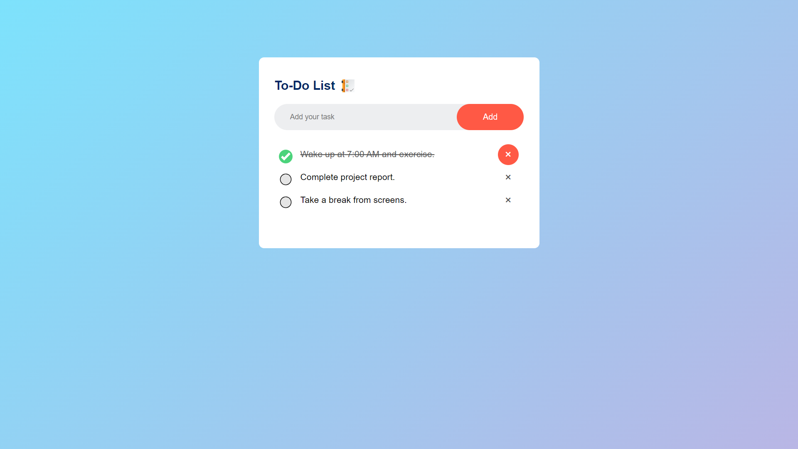

# Productiva 📝

A simple and intuitive to-do list application to help you stay organized and productive.

## Features

- Add new tasks
- Mark tasks as completed
- Delete tasks
- User-friendly interface

## Screenshots

!Productiva Screenshot

## Installation

1. Clone the repository:
   ```bash
   git clone https://github.com/rushikeshtagadkar/productiva.git
   ```
2. Navigate to the project directory:
   ```bash
   cd productiva
   ```
3. Open `index.html` in your browser to view the application.

## Usage

1. Enter your task in the input field.
2. Click the "Add" button to add the task to the list.
3. Click the checkbox to mark a task as completed.
4. Click the red 'x' to delete a task.
